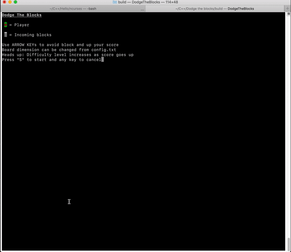
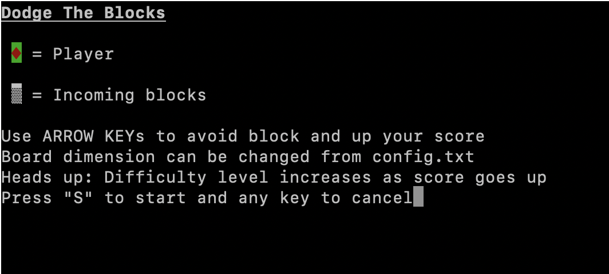

# Dodge The Blocks
A fun 2D terminal game built with C++.

## Description
The player has to dodge the incoming stream of obstacles. The player is spawned at the bottom of the playground or board. Obstacles would generate on top of the board and would start to come down to hit the player. Each obstacle would have some gaps. Player would have to take advantage of the gaps by pressing the `Arrow Keys` and dodge the obstacles. The game is inspired by [Pass The Blocks](https://github.com/niaz-ahsan/Pass-The-Blocks)

## Dependency
This project has dependency on [ncurses library](https://invisible-island.net/ncurses/announce.html) for visual representation and [cmake](https://cmake.org/download/) for compiling and running the project.

## Setting configuration
Game board or boundary is modifiable from the `config.txt` file. Below are the things to remember while updating the config file.

1. width/length ratio = 2 : 1. If width = 70, length = 35.
2. 100 &ge; width &ge; 30   

## Instructions to run
1. Navigate to project directory and run `mkdir build && cd build` on terminal.
2. Run `cmake .. && make`. This will generate an executable inside `build` folder named `DodgeTheBlocks`
3. Run `./DodgeTheBlocks`
4. A display will appear as below  
 
5. Press 'S' (not case-sensitive) to get in action or any key to terminate the program.    

## Note
Once there's a collision everything halts. Please press any of the `Arrow Keys` to get to the next screen.

